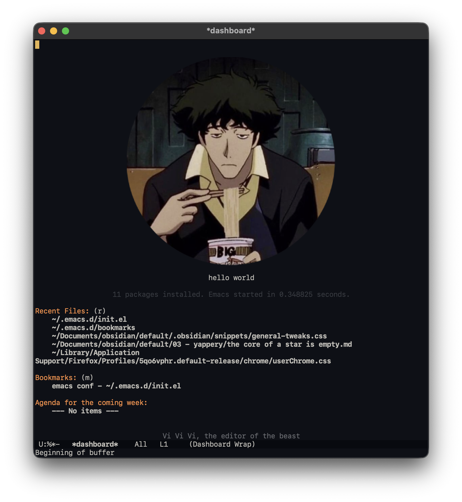
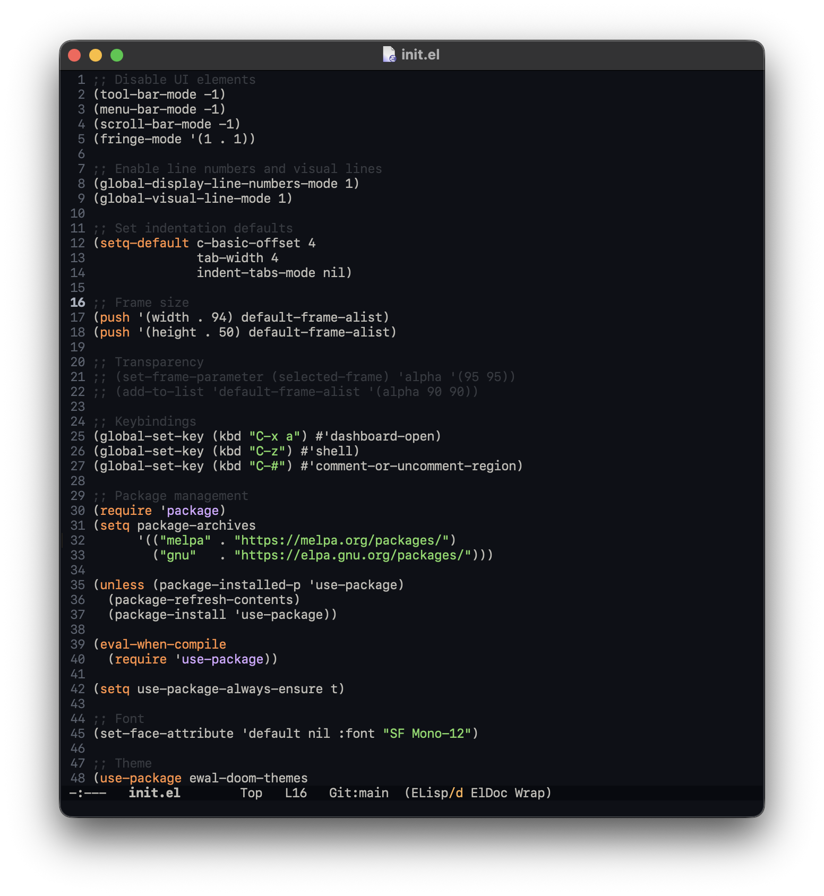

    <h1>emacs <i>riced up</i></h1>
  

    
    
  

## what's this?

a minimal Emacs config that looks good and feels snappy. no bloat, just the essentials to edit code fast and keep the UI clean.

everything is intentionally small and readable so you can tinker quickly.

## setup

1. clone this repo into your `~/.emacs.d`.
2. restart emacs and get comfy
